# EC2 인스턴스 시작하기. 

AWS 의 가장 기본적인 기능으로 컴뮤팅 머신을 제공합니다. 가상 장비를 할당받아, 사용자가 원하는 환경을 구성할 수 있으며, 기본 가상환경을 위한 다양한 옵션을 제공하고 있습니다. 

## EC2 컨테이너 생성하기. 

AWS 가 제공하는 다양한 서비스를 한번에 검색할 수 있도록 검색기능을 제공합니다. \
아래 검색 창에서 EC2를 입력하면 EC2와 관련된 서비스들을 확인할 수 있습니다. \
EC2를 선택합니다. 

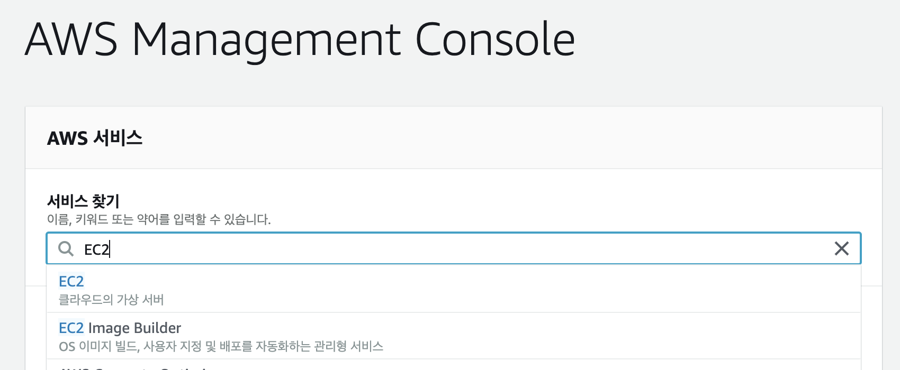

선택하면 아래와 같은 현재 EC2 컴퓨팅 자원들의 상세 정보를 확인할 수 있습니다. \
해당 내용에서 현재 실행중인 인스턴스정보(인스턴스의 의미는 실제 생성된 자원을 인스턴스라고 부릅니다.)와 디스크 볼륨 등 다양한 정보를 한눈에 확인할 수 있습니다. \
아래 `인스턴스 시작` 을 클릭합니다. 

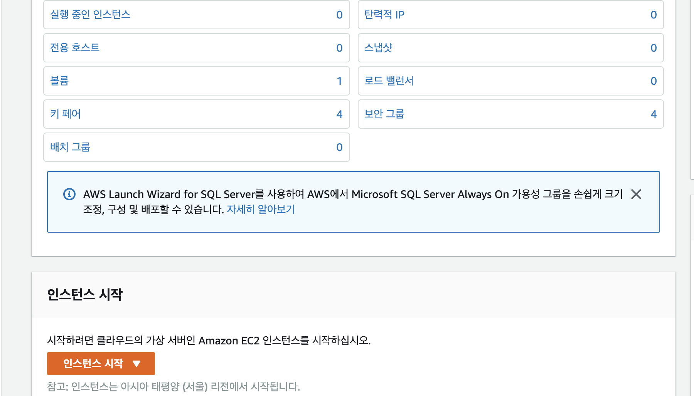

### 1. AMI 선택하기 
다음은 AMI(Amazon Machine Image) 를 선택하는 부분이 나옵니다. \
AMI는 사전 설치된(이를 Provision 이라고 부릅니다.) 운영체제와 기본 설치 프로그램들을 그대로 이미지화 한 것입니다. 가상 머신은 이러한 이미지만 있으면 몇대의 인스턴스 라도 동일하게 찍어낼 수 있습니다. \
여기에서는 다양한 OS 를 제공하고 있으며, 서비스를 위해 가장 적합한 이미지를 선택합니다. 우리는 가장 첫번째 이미지를 선택하도록 하겠습니다. \

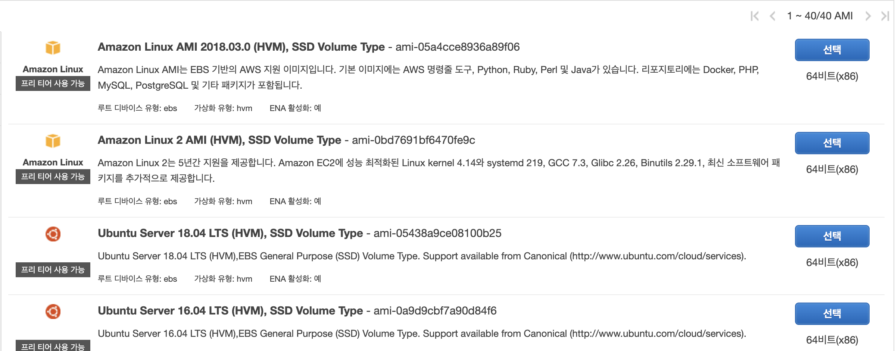

### 2. 인스턴스 유형 선택하기 
다음으로 이미지를 이용할 머신을 선택합니다. 우리의 경우 FreeTier 를 이용하기 위해서 녹색 딱지가 붙어 있는 T2.micro 를 선택할 것입니다. 

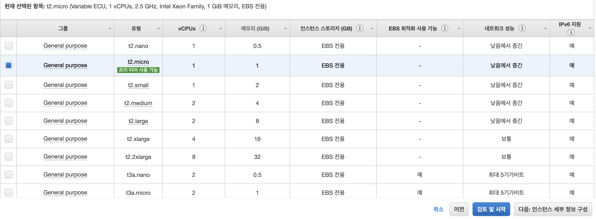

이미지 선택 항목에는 다음과 같은 필드들의 내용을 확인할 수 있습니다. 

- 그룹: 제공하는 인스턴스 유형을 나타냅니다. 
- 유형: 각 인스턴스 유형의 디테일한 사양을 선택합니다. T2.micro 는 프리티어로 제공하고 있습니다. 
- vCPUs: 가상 CPU 개수를 나타냅니다. 예제에서는 1개의 CPU 를 제공합니다. 
- 메모리(GiB): 인스턴스 실행시 제공하는 메모리 사양입니다. 1Gb 를 할당 받았습니다.
- 인스턴스 스토리지(EBS전용): 인스턴스가 실행되면, 해당 OS 에서 제공하는 로컬 저장소를 나타냅니다. 이 인스턴스는 인스턴스가 정지되는경우 혹은 인스턴스가 종료되는 경우 완전히 사라집니다. 사라진 데이터는 복구가 불가능하니 중요 데이터를 로컬 스터리지에 남기면 안됩니다. 
- EBS최적화 사용가능: 이는 인스턴스와 EBS(Elastic Block Storage)를 사용할 때 성능개선 서비스를 적용할 수 있는지 여부를 나타냅니다. 성능 최적화를 하면 IOPS 라고 하는 측정 단위만큼 성능을 보장합니다. 
- 네트워크 성능: 인스턴스에서 네트워크로 데이터를 전송하는 성능을 나타냅니다. 프리티어는 `낮음에서 중간`을 제공합니다.
- IPV6 지원: IPV6를 지원할지 여부를 알려줍니다. 일반적으로 지원합니다. 

위 사양에 맞는 인스턴스를 생성하게 됩니다.

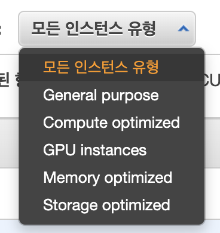

AWS 에서 제공하는 인스턴스 유형은 다음과 같습니다. 

- General purpose: 일반적인 목적으로 사용하는 인스턴스입니다. (tX, mX 프리픽스가 붙습니다.) 웹서버를 올리는 등의 일반적인 서비스로 활용할 수 있습니다. 
- Compute optimized: 계산에 집중된 인스턴스 사양을 제공합니다. (cX 프리픽스가 붙습니다.) CPU집약적인 처리가 필요한경우 적합합니다. 
- GPU instances: GPU 는 머신러닝등의 사유로 주로 이용하며, (gX, pX 프리픽스가 붙습니다.) GPU 의 사양에 따라 러닝 성능이 향상됩니다. 
- Memory optimized: 메모리를 많이 소비하는 인스턴스를 위한 사양을 제공합니다. (rX, xX, zX 프리픽스가 붙습니다.) 보통 메모리 기반의 스토리지를 필요로 하는 어플리케이션 (Redis, MongoDB 등과 같은 NoSQL) 에 적합합니다. 
- Storage optimized: 저장공간을 많이 필요로 하며, 저장공간에 데이터 읽기/쓰기를 필요로 하는경우 많이 사용합니다. (dX, iX 프리픽스가 붙습니다.) 일반적으로 데이터베이스, Hadoop 등과 같은 스토리지 집약적인 서비스에 적합합니다. 

이들은 각 사용 용도에 따른 정보를 바탕으로 시스템의 사양을 그룹화한 내용입니다. 이 그룹 내에서 다시 시스템의 사양이 나뉘어 집니다. \
[인스턴스유형](https://aws.amazon.com/ko/ec2/instance-types/) 에서 자세한 사항을 확인하면 인스턴스 선택에 도움이 됩니다. 

### 3. 인스턴스 세부정보 

기본 사양을 선택했다면, 이제는 상세 설정을 수행할 차례 입니다. 일반적인 케이스에서는 별도 설정을 해주지 않아도 되지만 상세 내역을 알아보겠습니다. 

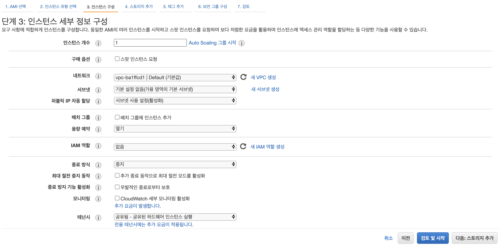

- 인스턴스 개수: 생성할때 몇대의 가상 머신을 생성할지 결정합니다. 기본값은 1이지만, 필요에 따라 여러대의 가상 머신을 생성해 낼 수 있습니다. 
- Auto Scaling 그룹시작: 시스템 트래픽이 증가하는 경우 특정 임계치를 넘었을때 인스턴스를 확장하도록 하는 정책을 설정합니다. 인스턴스의 증가/감소에 대한 정책을 설정하는 것을 Auto Scaling 그룹이라고 하며 이를 설정합니다. 
- 구매 옵션: 스팟 인스턴스(짧은 시간 사용하고, 다시 구매해서 사용하는 인스턴스) 를 설정합니다. 스팟 인스턴스는 지정된 시간의 인스턴스를 경매 방식처럼 금액을 제시하고, 높은 금액을 제시한 사용자에게 인스턴스를 할당해주는 서비스 입니다. 일시적으로 제품을 사용하거나, 비용 절약을 위해서 스팟 인스턴스를 활용하기도 합니다. 
- 네트워크: 네트워크 항목은 VPC(Virtual Private Cloud) 내에 인스턴스를 위치 시킬지 결정합니다. VPC 를 지정하지 않으면 기본적으로 제공하는 VPC 내에 인스턴스를 생성하지만, 시스템 아키텍처를 회사나 조직에서 미리 구성해두고 해당 클라우드 영역의 정책 내부에 인스턴스를 두어 보안과 시스템 그룹핑을 위해 사용합니다. 일반적으로 서비스 제품을 구성할 때 이 VPC 는 필수적으로 구성하므로 [VPC 알아보기](https://ap-northeast-2.console.aws.amazon.com/vpc/home?region=ap-northeast-2) 에서 확인해 보면 도움이 됩니다. 
- 서브넷: VPC 를 구성했다면 내부적으로 서브넷을 구성할 수 있습니다. 서브넷을 구성하면 네트워크 범위를 특정 그룹으로 지정하여 네트워클르 나눌 수 있습니다. 
- 퍼블릭 IP 자동할당: 인스턴스가 실행될때 퍼블릭 IP가 인스턴스에 자동으로 할당되도록 합니다. 고정된 IP가 필요한경우 EIP(Elastic IP) 를 할당받아서 사용하면 됩니다. 
- 배치그룹: 배치그룹은 시스템의 성능, 안정성 등을 고려하여 인스턴스를 배치할 수 있습니다. 배치 그룹은 클러스터, 분산형, 파티션형 등으로 구분되며, 서비스의 특성에 따라 선택할 수 있습니다. 
- 용량예약: 용량 예악은 인스턴스를 특정 목적에 적합한 시스템 자원을 최대한 활용할 수 있도록 용량을 예약할 수 있도록 합니다. 
- IAM 역할: 이전 인스턴스를 생성할 때 Role 를 생성한것과 같이 보안 정책을 선택할 수 있습니다. 
- 종료방식: 인스턴스 내에서 시스템을 종료하는 경우 어떻게 동작하게 할지 선택합니다. 중지는 인스턴스를 잠시 꺼 두는 것이고, 종료는 인스턴스 자체를 제거하는 터미네이션입니다. 
- 종료 방지 기능 활성화: 의도치 않은 종료로 부터 인스턴스를 보호하고자 할 때 사용합니다. 
- 모니터링: 인스턴스의 시스템 상태를 모니터링 활성화를 수행할 수 있습니다. 기본은 5분 간격이며, 유료 버젼으로 더 짧은 주기로 모니터링을 할 수 있습니다. 

초기 생성시에는 설정없이 그대로 넘어가도 상관없으며 앞으로 상세 항목에 대해서 알아보도록 하겠습니다. 

### 4. 스토리지 추가 

인스턴스를 생성할 때 기본 로컬 저장소를 제공합니다. 그러나 로컬 저장소는 인스턴스가 중지나 종료되면 유실되므로 중요 정보를 저장하기에는 무리가 있습니다. \
새로운 EBS(Elastic Block Storage) 를 지정하면 해당 인스턴스에 외부 스토리지를 연동하여 안정적인 저장소를 제공할 수 있습니다. 

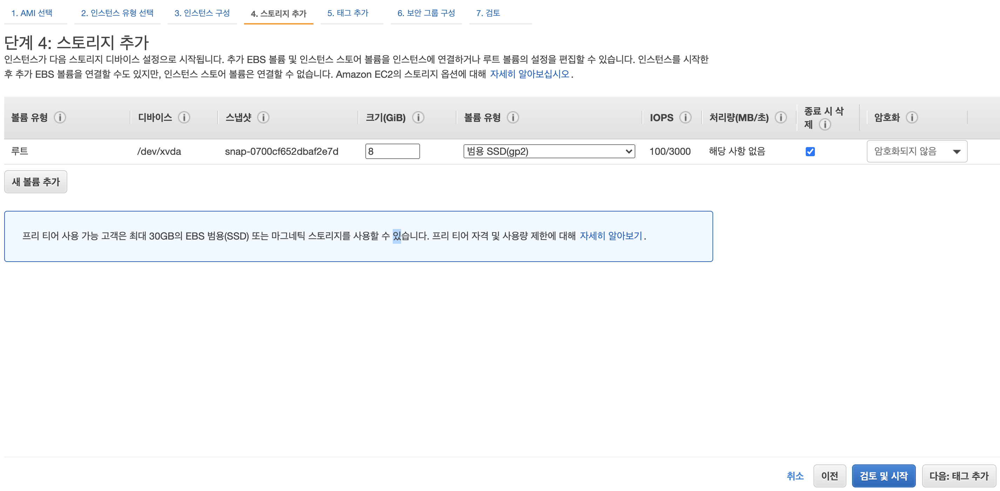

- 볼륨 유형: 루트는 로컬 저장소를 나타내며, 새로 추가하는 경우 EBS 를 선택할 수 있습니다. 
- 디바이스: 인스턴스 파일 시스템에 마운트될 디바이스 이름을 나타냅니다. 
- 스냅샷: 볼륨은 스냅샷을 뜰 수 있으며 이는 S3에 저장됩니다. 새로 인스턴스를 연동할 때 스냅샷을 연동할 수 있습니다. 
- 크기: 사용할 저장소 크기를 설정합니다. GB 단위
- 볼륨유형: 볼륨 유형은 스토리지 의 저장소 타입으로 범용 SSD, 프로비져닝된 SSD, 콜드 HDD, 처리량에 최적화된 HDD, 마그네틱등 다양한 장치를 선택할 수 있습니다. 
- IOPS: 이는 디스크에 읽기 쓰기 성능을 나타냅니다. 기본 제공하는 성능 이외 향상된 성능을 위해서는 IOPS(Input/Output Per Seconds) 계약을 통해서 증설할 수 있습니다. 
- 처리량(MB/s): 볼륨이 제공하는 처리량을 나타냅니다.
- 암호화: 볼륨에 저장할 데이터 암호화 여부를 결정합니다. 

### 5. 태그 추가 

태그는 운영을 위한 옵션입니다. 태그를 지정하면 운영자가 읽기 쉬운 형태로 태그를 지정할 수 있습니다. 

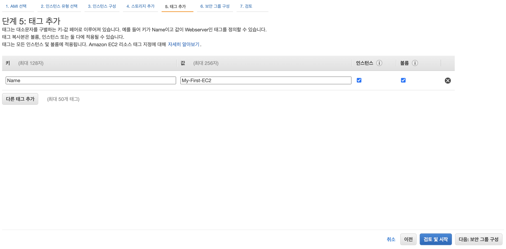

우리가 생성할 인스턴스의 Name 라는 키에 My-First-EC2 라는 값을 할당했습니다. 이를 통해서 인스턴스 목록에서 쉽게 구분할 수 있습니다. 

### 6. 보안그룹 추가 

보안그룹은 인스턴스에 대해서 어떠한 인터페이스를 지원할지를 결정하는 설정입니다. \
우리의 예제에서는 SSH 접속을 위한 보안 그룹을 추가했습니다. 

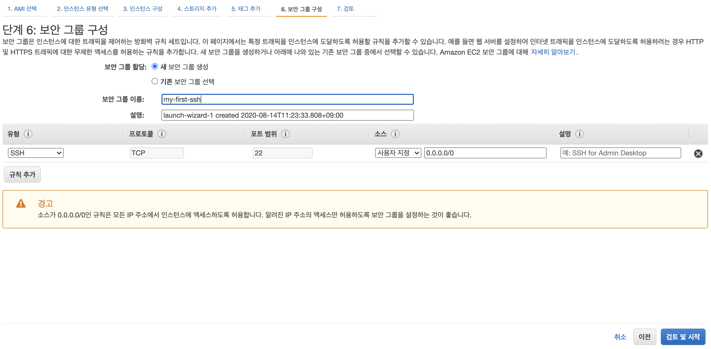

- 보안그룹 할당: 보안그룹은 인스턴스에 접근할 수 있는 보안설정을 재사용 할 수 있습니다. 이미 만들어져 있는 보안그룹을 사용할지 새로운 보안그룹을 생성할지 결정할 수 있습니다. 
- 보안그룹 이름: 보안그룹의 이름을 지정하거나, 선택할 수 있습니다. 
- 유형: 보안 그룹 정책을 할당할 유형입니다. SSH, HTTP, HTTPS, TCP 등 다양한 유형을 선택할 수 있습니다. 
- 프로토콜: 프로토콜을 선택합니다. TCP혹은 UDP 가 설정됩니다.
- 포트범위: 서비스마다 고정된 포트가 있거나, 사용자가 보안을 적용할 포트를 선택할 수 있습니다. SSH 는 기본 22입니다. 
- 소스: 인스턴스로 들어오는 외부 IP 혹은 IP 대역을 지정할 수 있습니다. 
- 설명: 보안그룹을 위한 설명을 추가할 수 있습니다. 

### 7. 인스턴스 시작 검토 

지금까지 설정한 옵션등을 한눈에 볼 수 있습니다. 자신이 설정한 내역과 일치한다면 다음으로 넘어가면 됩니다. 

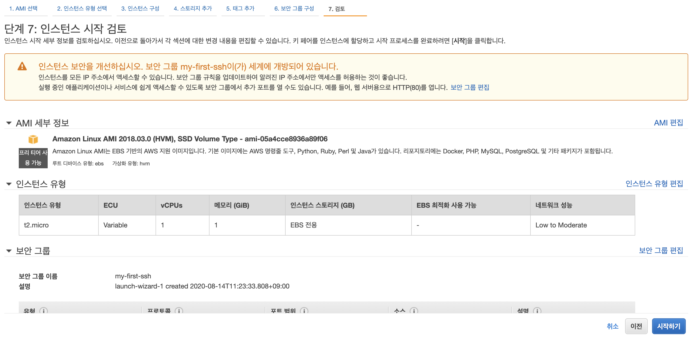

### 8. 키 페어 선택 

키 페어는 인스턴스에 접근하기 위한 키페어를 생성하는 것입니다. 우리의 컴퓨터에서 생성하는 인스턴스에 콘솔로 접근하기 위해서는 반드시 키페어를 할당해야하며, 키페어를 다운받으면 다시 다운받을 수 없습니다. 그러므로 매우 신중하게 괸리해야합니다. 

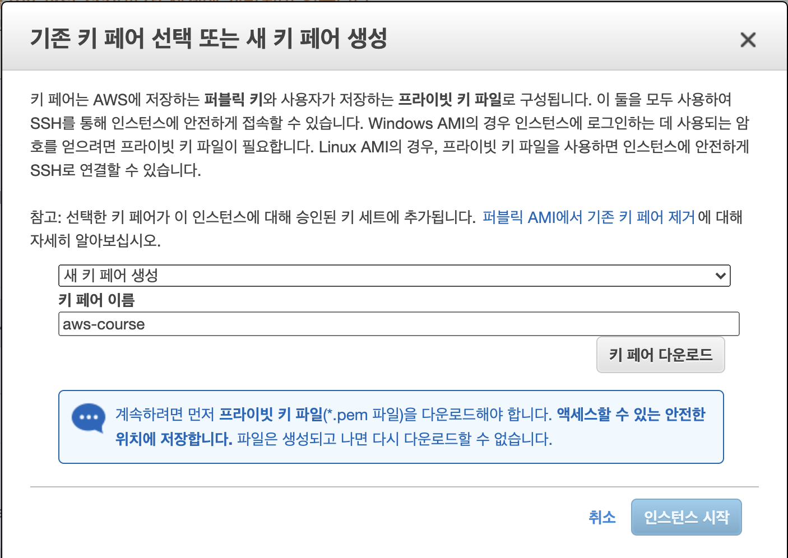

새 키페어 생성을 선택하고 aws-course 라는 키페어를 생성했습니다. 
그리고 `키페어 다운 로드`를 선택하여 키페어를 다운 받습니다. 그렇게 되면 다운로드 폴더에 aws_course.pem 파일을 확인 할 수 있습니다 .

### 9. 상태 보기

생성을 선택했다면 현재 인스턴스 생성 상태를 확인할 수 었습니다. 

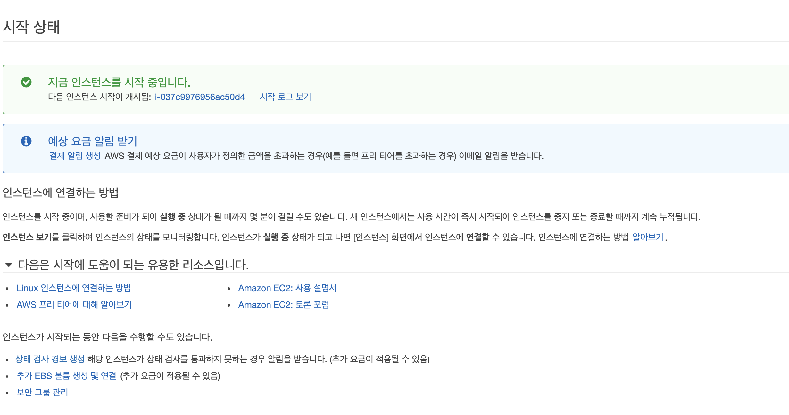

### 10. 생성된 인스턴스 목록 보기 

생성된 목록을 확인하려면 AWS 검색창에서 EC2를 선택하고, 목록을 확인해 볼 수 있습니다. 

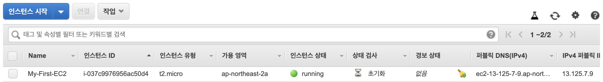

- Name: 이전 붙여두었던 태그가 보입니다. (My-First-EC2) 입니다.
- 인스턴스 ID: 우리가 생성한 인스턴스를 구분할 수 있는 유니크한 아이디 입니다 .
- 인스턴스 유형: 선택한 t2.micro (프리티어) 가 확인됩니다.
- 가용영역: 가용영역은 Available Zone으로 한국에는 a, b, c 3개의 가용영역이 있으며 이중 우리의 인스턴스는 a 에 속합니다. 
- 인스턴스 상태: 현재 running 으로 인스턴스가 실행중에 있음을 알 수 있습니다. 

## 인스턴스 접속하기. 

이제 인스턴스에 접속해 보겠습니다. 저의 경우 mac 에서 실행할 것입니다. 

인스턴스 목록 > 인스턴스 체크박스 선택 > 연결 을 클릭하면 연결하는 방법에 대해서 상세하게 설명해 주고 있습니다. 

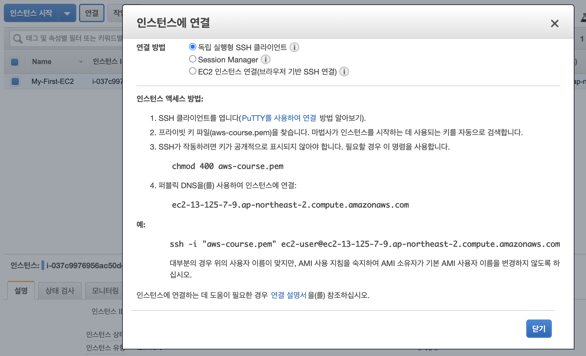

위 내용과 같이 aws_course.pem 이 있는 디렉토리로 이동하여 다음 명령을 실행합니다. 

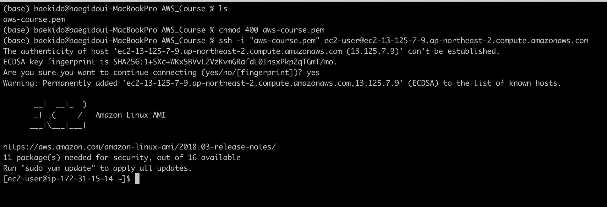

### pem 권한 설정하기. 

pem 권한을 400 으로 지정해 줍니다. 즉, 파일 소유자만이 읽기 전용으로 설정합니다. 400으로 권한을 지정해주지 않으면 인스턴스에 접근할 수 없으니 이 부분은 반드시 필요한 부분입니다. 

콘솔에서 ssh을 통해서 인스턴스에 접근하였습니다. 여기서 부터 우리는 필요한 소프트웨어를 설치하거나, 서비스 인스턴스를 실행할 수 있습니다. 