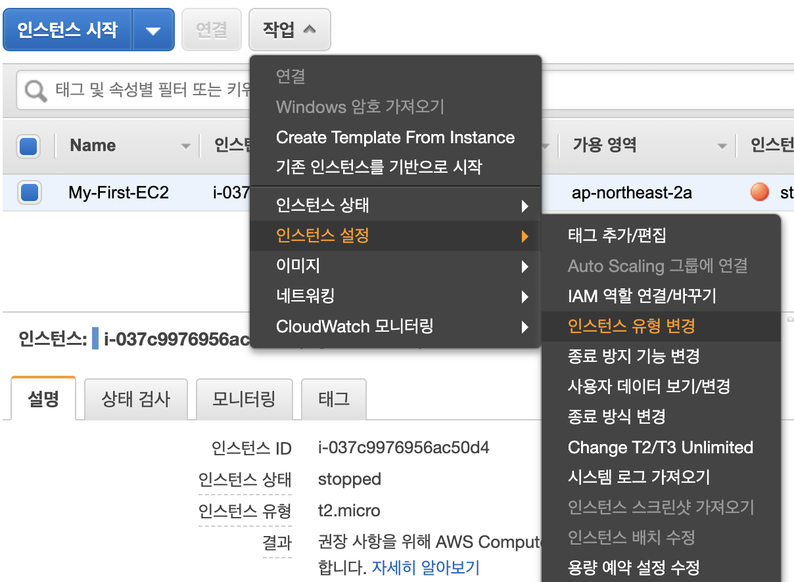

# Instance 변경하기. 

인스턴스를 생성해서 사용하다보면, 스케일 업을 수행하거나 스케일 다운을 해야하는 경우도 발생할 수 있습니다. \
일반적으로 시스템을 운영할때 리소스 자원이 부족한경우 스케일업을 수행해야합니다. 반면에 리소스 사용량이 작은데, 필요한 사양보다 더 큰 사양을 사용하고 있다면 스케일 다운을 통해서 클라우드 사용 비용을 절약해야합니다. 

## 인스턴스 유형 변경하기. 

인스턴스를 유형을 변경하기 위해서는 EC2 > 실행중인 인스턴스에 접속하여 인스턴스 목록을 확인합니다. 


현재 인스턴스는 My-First-EC2가 인스턴스가 실행중에 있습니다. 인스턴스가 정지 상태에 있어야 인스턴스를 변경할 수 있습니다. 

아래와 같이 작업 > 인스턴스 상태 > 중지 를 선택합니다. 


중지하고 나면 아래와 같이 인스턴스 유형변경이 활성화 됩니다. 



클릭해주면 다음과 인스턴스 유형을 변경할 수 있는 목록이 나타납니다.


t2.small 로 한번 변경해 보겠습니다. 사실 인스턴스가 프리티어가 아니크로 변경후 비용이 발생합니다. 


확인한 인스턴스 유형이 변경이 되었네요. 이제 실행하면 스케일 업이 됩니다.

## 인스턴스 유형 변경시 로컬 스토리지는 어떻게 될까? 

인스턴스 유형이 변경이 되면 로컬 스토리지 데이터가 유지가 되는지 살펴 보겠습니다. \
인스턴스가 실행되었다면 터미널로 접속하여 파일을 만듭니다. 

```
(base) baekido@baegidoui-MacBookPro AWS_Course % ssh -i "aws-course.pem" ec2-user@ec2-13-209-11-224.ap-northeast-2.compute.amazonaws.com

The authenticity of host 'ec2-13-209-11-224.ap-northeast-2.compute.amazonaws.com (13.209.11.224)' can't be established.
ECDSA key fingerprint is SHA256:1+SXc+WKx5BVvL2VzKvmGRafdL0InsxPkp2qTGmT/mo.
Are you sure you want to continue connecting (yes/no/[fingerprint])? ㅛ yes
Warning: Permanently added 'ec2-13-209-11-224.ap-northeast-2.compute.amazonaws.com,13.209.11.224' (ECDSA) to the list of known hosts.
Last login: Fri Aug 14 03:49:28 2020 from 203.236.3.227

       __|  __|_  )
       _|  (     /   Amazon Linux AMI
      ___|\___|___|

https://aws.amazon.com/amazon-linux-ami/2018.03-release-notes/
11 package(s) needed for security, out of 16 available
Run "sudo yum update" to apply all updates.
[ec2-user@ip-172-31-15-14 ~]$ ls
[ec2-user@ip-172-31-15-14 ~]$ echo HelloWorld > greeting.txt
[ec2-user@ip-172-31-15-14 ~]$ ls
greeting.txt
[ec2-user@ip-172-31-15-14 ~]$ cat greeting.txt
HelloWorld
```

파일을 하나 만들었습니다. 

이제 인스턴스 유형을 다시 변경해 보겠습니다. 원래 프리티어로 돌려 보겠습니다. 

변경후 다시 인스턴스를 실행하면 다음과 같이 이전 파일이 그대로 존재하는지 확인할 수 있습니다. 

```
(base) baekido@baegidoui-MacBookPro AWS_Course % ssh -i "aws-course.pem" ec2-user@ec2-52-78-17-180.ap-northeast-2.compute.amazonaws.com

The authenticity of host 'ec2-52-78-17-180.ap-northeast-2.compute.amazonaws.com (52.78.17.180)' can't be established.
ECDSA key fingerprint is SHA256:1+SXc+WKx5BVvL2VzKvmGRafdL0InsxPkp2qTGmT/mo.
Are you sure you want to continue connecting (yes/no/[fingerprint])? ㅛ yes
Warning: Permanently added 'ec2-52-78-17-180.ap-northeast-2.compute.amazonaws.com,52.78.17.180' (ECDSA) to the list of known hosts.
Last login: Fri Aug 14 06:28:11 2020 from 203.236.3.227

       __|  __|_  )
       _|  (     /   Amazon Linux AMI
      ___|\___|___|

https://aws.amazon.com/amazon-linux-ami/2018.03-release-notes/
11 package(s) needed for security, out of 16 available
Run "sudo yum update" to apply all updates.
[ec2-user@ip-172-31-15-14 ~]$ ls
greeting.txt
[ec2-user@ip-172-31-15-14 ~]$ cat greeting.txt
HelloWorld
```


