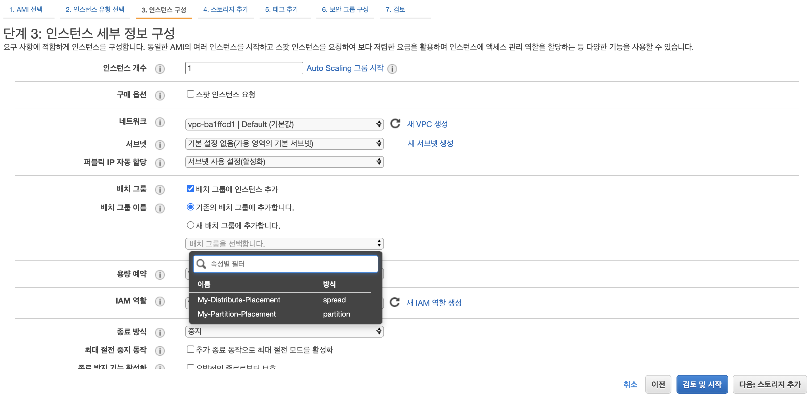

# EC2 Placement Group 이해하기

EC2 플레이스먼트 그룹은 처음 이미지 생성시에 잠시 살펴 보았습니다. 플레이스먼트 그룹을 통해서 인스턴스간 네트워크 통신에서 성능을 향상 시키거나 혹은 인스턴스의 안정성을 우선적으로 고려할지에 따라서 다양하게 구성할 수 있습니다. 

[Placement Group](https://docs.aws.amazon.com/ko_kr/AWSEC2/latest/UserGuide/placement-groups.html) 에서 자세한 내역을 확인할 수 있습니다. 

## 플레이스먼트 그룹 종류

- 클러스터 플레이스먼트 그룹
  - 가용영역 내에 근접한 위치에 인스턴스를 배치합니다. 
  - 네트워크 속도 향상을 위해 낮은 Latency 가 필요한경우 사용합니다.
- 파티션 플레이스먼트 그룹
  - 논리적인 파티셔을 구성해두고, 인스턴스를 파티션에 배치합니다. 
  - 동일한 AZ 에 여러개의 파티션을 분리하며, 파티션은 물리적으로 분리 된 랙에 배치 됩니다. 
  - 인스턴스를 파티션에 배치하므로 파티션이 문제가 생기면 파티션내 모든 인스턴스에 이슈가 생길 수 있습니다. 
- 분산 플레이스먼트 구룹 
  - 서로다른 az 에 인스턴스를 배치하며, 안정성이 매우 높습니다. 
  - 안정성이 높은반면 네트워크 레이턴시가 발생할 수 있습니다. 

## 플레이스먼트 그룹 살펴보기 

플레이스먼트 그룹을 생성해 보겠습니다. `EC2 > 네트워크 및 보안 > 배치 그룹` 을 선택합니다. 

여기에서 `배치 그룹 생성` 버튼을 클릭하여 생성할 수 있습니다. 

### 클러스터 배치 생성하기 

- 이름: My-Group-Placement 
- 배치전략: 클러스터
- 태그:
  - Nmae: My-Group-Placement

로 생성합니다. 

### 파티션 배치 생성하기. 

- 이름: My-Partition-Placement
- 배치전략: 파티션
- 파티션수: 2 (파티션수는 7개 꺄지 지정할 수 있습니다.)
- 태그:
  - Name: My-Partition-Placement

### 분산 배치 생성하기. 

- 이름: My-Distribute-Placement
- 배치전략: 분산
- 태그: 
  - Name: My-Distribute-Placement

모두 생성한경우 배치그룹을 다음과 같이 확인 할 수 있습니다 .

## 배치그룹 할당하기. 

인스턴스를 생성할 때 배치 그룹을 적용할 수 있습니다. 다음과 같이 배치 그룹을 지정할 수 있으며 t2.micro 에서 적용 가능한 배치그룹은 파티션, 분산 을 설정할 수 있습니다. 

위 그림과 같이 인스턴스 세부 정보 구성에서 생성한 배치 전략을 선정할 수 있습니다. 

### 파티션 플레이스먼트 할당

파티션 플레이스먼트 내역은 아래와 같이 대상 파티션을 지정하거나 자동으로 설정할 수 있습니다. 

### 분산 플레이스먼트 할당

분산의 경우 최대 7개로 설정이 가능합니다. 

### 클러스터 플레이스먼트 할당

클러스터 플레이스먼트는 인스턴스 유형에 따라 적용여부가 달라집니다. 

인스턴스 유형을 `m5ad.4xlarge`로 변경해 보겠습니다. 

유형이 변경되어 클러스터 플레이스먼트를 할당할 수 있게 되었습니다. 

## 플레이스먼트 장점 단점 알아보기 

### 클러스터 플레이스먼트

from: https://docs.aws.amazon.com/ko_kr/AWSEC2/latest/UserGuide/placement-groups.html#placement-groups-cluster

장점: 
- 인스턴스 간의 네트워크 대역폭을 10G 로 지원합니다. 매우 Latency 를 줄일 수 있는 경우 적합합니다 .

단점: 
- 동일 rack 에 올라가므로 rack 장애가 인스턴스 전체 장애를 발생 시킵니다.

사용분야:
- 빅데이터 잡을 수행할 때 네트워크간 성능이 중요한경우 

### 파티션 플레이스먼트

from: https://docs.aws.amazon.com/ko_kr/AWSEC2/latest/UserGuide/placement-groups.html#placement-groups-partition

장점:
- AZ당 7개의 파티션을 생성할 수 있습니다. 
- 파티션내 인스턴스들은 racks 를 공유하지 않습니다. 
- 하나의 파티션의 장애가 다른 파티션에 영향을 주지 않는다. 
  
단점:
- 파티션의 실패가 동일파티션내 모든 인스턴스에 장애 발생
  
사용분야:
- HDFS, HBase 등의 NoSQL 에 적용 

### 분산 플레이스먼트 

from: https://docs.aws.amazon.com/ko_kr/AWSEC2/latest/UserGuide/placement-groups.html#placement-groups-spread

장점:
- 분할되었기 때문에 여러 AZ 로 인스턴스 분산이 쉽다. 
- 동시에 실패가 나든 경우가 발싱하지 않는다. (분산뒤어 있으므로 장비 이슈가 다른데 영향을 주지 않는다.)

단점:
- AZ 당 7개만 생성이 가능합니다. 

사용분야:
- HA 구성이 필요한 애플리케이션에서 적합합니다. 

지금까지 Placement Group 을 확인해 보았습니다. 어떠한 Placement Group(배치그룹)을 선택할지는, 시스템의 안정성과 Latency 를 고려하여 적절히 선택하면 됩니다. 

자세한 정보는 https://docs.aws.amazon.com/ko_kr/AWSEC2/latest/UserGuide/placement-groups.html 에서 자세히 확인하면 도움이 됩니다. 