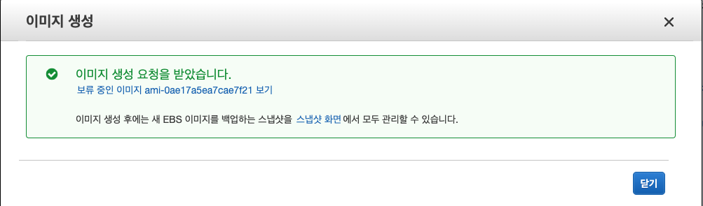

# Custom AMI 생성하기. 

1. Console 접속하기. 
2. httpd 설치하기. 
```
% sudo su

% yum update -y

% yum install -y httpd
```
3. httpd 실행하기. (Amazon Linux 2에서만 systemd가 실행가능, 여기서는 service 를 이용해야함.)
```
% systemctl enable httpd

% systemctl start httpd
```

```
% service httpd start
Starting httpd:                           [  OK  ]

% service httpd status
httpd (pid  3309) is running...
```
4. 인스턴스 확인하기
```
% echo "Hello World" > /var/www/html/index.html
% curl http://localhost:80

Hello World
```
5. SecurityGroup 추가하기. 
 

http 에 대한 Inbound 규칙 추가해주기. 

브라우저에서 확인하기. 
 

위 화면과 같이 HTTP 에 대한 요청을 브라우저에서 할 수 있게 된다. 

6. Image 생성하기. 
 

이미지 > 이미지 생성을 클릭한다. 

 

- 이미지 이름: ApacheServerImage
- 이미지 설명: MyFirstImage

를 선택하고 `이미지 생성` 을 클릭한다. 

 

이미지 생성을 확인하기 위해서 좌측메뉴에서 `이미지 > AMI` 를 클릭하면 이미지를 확인할 수 있다. 

 

7. 이미지를 다른 리젼으로 복사하기. 

이미지를 다른 리젼으로 복사하기 위해서는 `이미지 > AMI` 에서 생성한 이미지에서 `오른쪽 클릭 > AMI 복사` 를 클릭하고, 대상 리젼을 선택하고 복사 할 수 있다. 

 

 

8. 이미지를 활용하여 인스턴스 실행하기. 

 

시작하기를 클릭하면 EC2 인스턴스를 생성 과정을 전행할 수 있다. 

해당 이미지는 우리가 이전에 만든 httpd 를 그대로 실행하기 때문에, 생성즉시 공유 IP 를 활용하여 접근 테스트 할 수 있다. 
