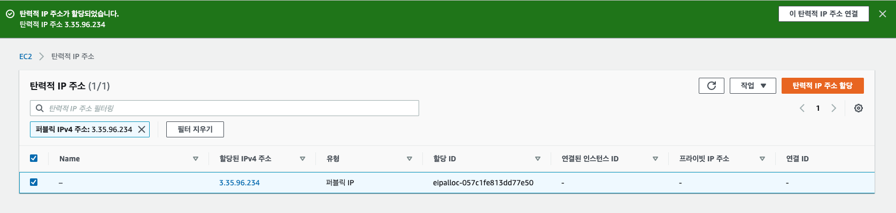

# ElasticIP

인스턴스를 stop 하고 다시 싫애하면 Public Ip 가 변경이 되지만, EIP 를 이용하면 고정된 IP 를 이용할 수 있다. 

EIP 는 한번에 하나의 인스턴스에 할당이 가능하며, 떼었다가, 다른 인스턴스에 붙일 수 있다. 

EIP 는 생성하고, 서버에 연동을 해두면 비용이 부과되지 않는다. 그러나 EIP를 사용하지 않는다면 비용이 부과된다. 

계정당 5개의 EIP 를 할당할 수 있다. 문의하면 증설은 할 수 있다. 

## EIP 할당하기. 

`네트워크 및 보안 > 탄력적 IP` 선택한다. 

탄력적 IP 생성을 클릭한다. 

할당을 클릭하면 새로운 EIP 가 할당된다. 

위 금과 같이 새로운 EIP가 생성이 되었다. 

## EIP 바인딩하기. 

EIP 를 클릭하여 상세 정보를 보자. 

`탄력적 IP 주소 연결` 을 클릭한다. 

인스턴스를 우리가 생성한 인스턴스에 연겷하자. My-First-EC2가 우리가 생성한 인스턴스이다. 그리고 `연결` 을 클릭하여 EIP 와 Instance 를 연결한다. 

연결하면 상세 정보가 변경된 것을 확인할 수 있다. EIP 와 EIP 가 할당된 인스턴스 정보를 한눈에 파악할 수 있다. 

수행중인 인스턴스에서 인스턴스 상세정보를 확인해보면 퍼블릭 IP 가 변경이 된 것을 확인할 수 있다.  

 
변경된 IP 로 접속했을때 정상적으로 결과가 나타나는 것을 확인할 수 있다. 

## EIP 연결 해제하기. 

이제 EIP 를 연결해제 해보자. 아래와 같이 EIP 메뉴에서 `작업 > 탄력적 IP 연결 해제` 를 클릭한다. 

연결 해제하면 금액이 부과된다는 안내가 나온다. 

## EIP 완젼히 릴리즈 하기. 

EIP 는 연결하지 않으면 비용이 부과되므로 사용하지 않고, 사용 계획이 없다면 릴리즈 하자. 

릴리즈 하면 더이상 해당 IP 를 할당할 수 없다고 나온다. 

릴리즈를 클릭하여 완젼히 해제해주면 된다. 

## 요약

지금까지 탄력적 IP 를 살펴 보았다. 고정 IP 가 필요하다면 탄력적 IP 를 활용하자. 

보통 로드 밸런서등에 할당해서 사용하는 것이 보통이며, 예제와 같이 인스턴스에 직접 할당하는 방법은 실제에서는 사용되지 않는 방식이다. 

그리고 할당하지 않으면 비용이 부과되므로 사용하지 않으면 꼭 릴리즈 해주자. 

