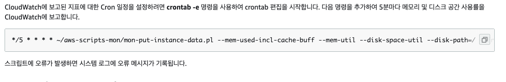

# CloudWatch 

AWS 는 인스턴스를 위한 메트릭을 제공하며 이를 CloudWatch 메트릭이라 한다. 

## AWS 가 직접 제공하는 메트릭 

무료 버젼은 5분 주기의 메트릭 수집을 수행하며, 금액을 지불하면 1분 단위로 메트릭 수집을 수행할 수 있다. 
CPU, Network, Disk, 인스턴스 상태 정보 

### AWS 기본 메트릭 살펴보기. 

인스턴스 하위 탭에서 `모니터링` 탭을 클릭하면 아래와 같은 인스턴스 정보를 확인할 수 있다. 


### 상세 모니터링 활성화 


와 같이 `세부 모니터링 활성화`를 클릭하면 세무 모니터링 1분단위를 활성화 할 것인지 물어본다. 

비용이 지물되는 서비스이므로 필요한경우 활성화 하자. 

## 커스텀 메트릭

사용자가 직접 메트릭을 보낼 수 있으며, 기본은 1분 주기의 메트릭을 보내며, 높은 수준은 1초단위로 보낼 수 있다. 
RAM, 어플리케이션에서 제공하는 메트릭이 있다. 

아래 가이드를 활용하여 RAM 메모리 모니터링을 해보자. 

[Amazon EC2 Monitoring](https://docs.aws.amazon.com/ko_kr/AWSEC2/latest/UserGuide/mon-scripts.html) 에서 CloudWatch 를 위한 설치과정을 알아보자. 

### RAM 모니터링을 위한 스크립트 설치. 

[Amazon EC2 Monitoring](https://docs.aws.amazon.com/ko_kr/AWSEC2/latest/UserGuide/mon-scripts.html) 참고

인스턴스에 ssh 를 통해서 접속한다. 


위와 커맨드를 복사하여 인스턴스 콘솔에서 설치해준다. 


위 커맨드를 활용하여 모니터링 스크립트를 설치한다. 

설치가 완료 되었다면 이제 메트릭을 AWS CloudWatch 에 전송해본다. 


위 명령을 통해서 AWS CloudWatch 에 메트릭 전송한다. 

그럼 아래와 같이 오류가 나타난다. 퍼미션이 존재하지 않는다는 오류이다. 


인스턴스에 가서, `인스턴스 설정 > IAM 역할 연결/바꾸기` 를 선택하여 IAM 롤을 확인하자. 


IAM 역할을 새로 생성하기 위해서 `새 IAM 역할생성` 을 클릭한다. 

그럼 다음과 같은 역할 만들기에서 메뉴를 확인할 수 있다. 다음을 선택하여 넘어가자. 


역할 만들기 화면이 나타나며, 우리는 여기서 `CloudWatch` 를 검색할 것이다. 

다양한 역할들이 나오느데 여기서 `CloudWatchFullAccess` 역할을 체크한다. 


역할 태그를 적절히 달아주자. 


그리고 역할 이름을 `CustomMonitoringRole` 로 달아주고 생성하기를 클릭한다. 


위화면과 같이 다시 IAM 역할 연결/바꾸기로 가서, IAM 역할에 방금 만든 역할을 할당한다. 그럼 EC2 인스턴스는 이 롤을 활용하여, CloudWatch 로 FullAccess 권한을 갖게 되는 것이다. 


역할 연결이 되었음을 확인하자. 

이제는 아래와 같이 다시 메트릭을 전송해보면 성공 메시지를 확인할 수 있다. 


역할을 확인했으니, 이제는 crontab 을 활용하여 자동으로 메트릭을 전송할 차례이다. 

아래 크론 잡을 등록할 것이다. 



아래와 같이 인스턴스 콘솔에서 crontab -e 를 통해서 편집을 하자. 

위 크론잡을 복사한 값을 붙여넣기 하고 ESC + wq! 를 수행하여 편집 내용을 저장한다. 


이제 CloudWatch 를 확인해 볼 때이다. `서비스 > CloudWatch` 를 검색하고 클릭하자. 


`지표 > 모든지표 > System/Linux` 를 클릭하여 메트릭을 확인해보자. 


가이드대로 스크립트는 MemoryUtilization, MemoryUsed, MemoryAvailable 등을 수집하고 있음을 알 수 있다. 

하나를 체크하면 상단 그래프에 지표가 나타난다. 


아래와 같이 cronjob의 로그를 확인해 볼 수 있다. 

```
$ sudo tail -f /var/log/cron
```

이 명령을 확인해보면 crontab에 발생한 이력을 확인할 수 있다. 정상적으로 수행하고 있음을 확인할 수 있다. 

크론잡을 `*/1 * * * * ...` 로 해주면, 1분에 한번씩 메트릭을 전송하게 된다. 


## CloudWatch Log Agent 활용하기. 

CloudWatch Log Agent 를 통해서 EC2 인스턴스 내에 Agent 를 설치하고, 로그를 CloudWatch 로 전송할 수 있다. 

자세한 내용은 [CloudWatch Log Agent](https://docs.aws.amazon.com/AmazonCloudWatch/latest/logs/QuickStartEC2Instance.html) 를 참조한다. 

### Agent 설치하기. 

우리는 이미 CloudWatchFullAccess IAM Role 를 설정하였음로, Agent를 설치하자. 


```
$ sudo yum install -y awslogs
```

### Agent Config 를 변경하기. 

로그 설정 확인하기. 

```
$ cat /etc/awslogs/awslogs.conf

... 중략
[/var/log/messages]
datetime_format = %b %d %H:%M:%S
file = /var/log/messages
buffer_duration = 5000
log_stream_name = {instance_id}
initial_position = start_of_file
log_group_name = /var/log/messages

```
우리의 로그 그룹은 /var/log/messages 이다. 

sudo vi /etc/awslogs/awscli.conf 에서 Region 을 인스턴스의 리젼으로 변경한다. ap-northeast-2

그리고 다음 명령을 통해서 실행한다. 

```
$ sudo service awslogs start

혹은 Amazon Linux 2 경우 

$ sudo systemctl start awslogsd

$ sudo systemctl enable awslogsd.service

```

### 로그 확인하기. 

`서비스 > CloudWatch > 로그 > 로그그룹` 을 클릭한다. 


아래와 같이 로그 그룹을 확인할 수 있다. 

우리가 만든 로그 그룹은 기본 로그 그룹으로 `/var/log/messages` 이다. 클릭해보자. 


아래와 같이 상세 로그 그룹 정보를 볼 수 있다. 


로그 스트림을 클릭하면 해당 인스턴스의 로그 정보를 확인할 수 있다. 


## Wrapup

지금까지 CloudWatch 를 살펴 보았다. 기본 AWS CloudWatch 시스템 모니터링을 확인했고, 사용자가 지정한 커스텀 메트릭을 확인했다. 

마지막으로 CloudWatchAgent 를 활용한 로그를 살펴 보았다. 


